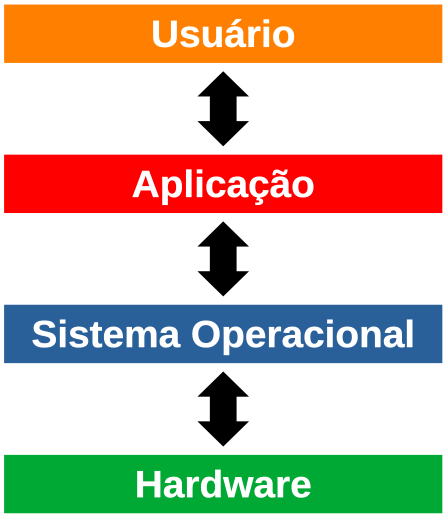

<!-- _paginate: false -->
# **Sistemas Operacionais Desktop**

## Aula 1 - Fundamentos de Sistemas Operacionais

---

## Sistema Operacional

- Um sistema operacional (SO) é um programa cujo trabalho é gerenciar os recursos do sistema (processador, memória RAM, sistema de arquivos, etc.), fornecendo uma interface entre o computador e o usuário
- Exemplos: MS-DOS, Windows, Linux, macOS, iOS, Android

---

## Sistema Operacional

---

## Sistema Operacional

- Problemas que os sistemas operacionais lidam:
  - Qual a ordem dos programas que terão acesso ao processador e por quanto tempo?
  - Quanto de memória será alocada/liberada para um programa?
  - Quais porções do disco (HDD ou SSD) correspondem a um determinado arquivo?

---

## Funções do Sistema Operacional

- Gerencia os recursos do sistema, como processadores, memória, dispositivos de armazenamento e periféricos, para garantir que os programas sejam executados de forma eficiente e sem conflitos
- Gerencia o armazenamento de arquivos e pastas, permitindo que os usuários criem, excluam, movam e renomeiem arquivos e pastas
- Gerencia a execução de programas e processos em segundo plano, permitindo que vários programas sejam executados concorrentemente

---

## Funções do Sistema Operacional

- Controla o acesso aos recursos do sistema e garante que apenas usuários autorizados possam acessá-los
- Fornece suporte para comunicação em rede, permitindo que os usuários acessem recursos remotos e se conectem à internet
- Gerencia o consumo de energia do sistema e pode ajustar as configurações de energia para prolongar a vida útil da bateria em laptops e dispositivos móveis

---

## Tipos de Sistemas Operacionais

- Monotarefa e Multitarefa
- Monousuário e Multiusuário
- Distribuído
- Embarcado
- Tempo real

---

## Monotarefa e Multitarefa

- Monotarefa
  - Permite que apenas um programa execute por vez
  - Exemplo: MS-DOS
- Multitarefa
  - Permite que mais de um programa execute *concorrentemente*
    - Concorrentemente porque é alocado uma fatia de tempo para cada programa utilizar o processador (time-sharing)
  - Exemplo: Linux

---

## Monousuário e Multiusuário

- Monousuário
  - Suporta apenas um usuário por vez (mas pode suportar recursos como a troca de usuário)
  - Exemplo: Windows
- Multiusuário
  - Suporta que vários usuários usem o computador ao mesmo tempo, seja por terminais ou por conexões remotas como o Secure Shell (SSH)
  - Exemplo: Linux e a maioria dos sistemas operacionais unix-like

---

# Distribuído

- Gerencia um grupo de computadores distintos em rede e os faz parecer um único computador, pois todos os cálculos são distribuídos (divididos entre os computadores constituintes)
- Exemplos: Amoeba e Plan 9

---

## Embarcado

- São sistemas operacionais capazes de operar em hardware com uma quantidade limitada de recursos (processamento, memória RAM e armazenamento)
- Exemplos: Windows CE e Minix 3

---

## Tempo real (Real-time)

- Garante o processamento de eventos ou dados em momento específico no tempo. São muito utilizados quando o tempo é uma restrição muito importante, como em sistemas de aeronaves e controles de uma usina nuclear
- Exemplo: VxWorks, QNX, eCos e RTLinux

---

## Referências Bibliográficas

- Tanenbaum, A. "Sistemas Operacionais Modernos, 3ª edição". São Paulo: Pearson Prentice Hall, 2010.
- Wikipedia. "Sistema Operativo". https://pt.wikipedia.org/wiki/Sistema_operativo, acessado em 02/05/2023
- Wikipedia. "Operating System". https://en.wikipedia.org/wiki/Operating_system, acessado em 02/05/2023

---

## Referências Bibliográficas

- Wikipedia. "Amoeba (operating system)". https://en.wikipedia.org/wiki/Amoeba_(operating_system), acessado em 02/05/2023
- Wikipedia. "Plan 9 from Bell Labs". https://en.wikipedia.org/wiki/Plan_9_from_Bell_Labs, acessado em 02/05/2023