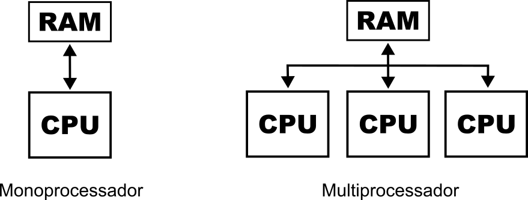
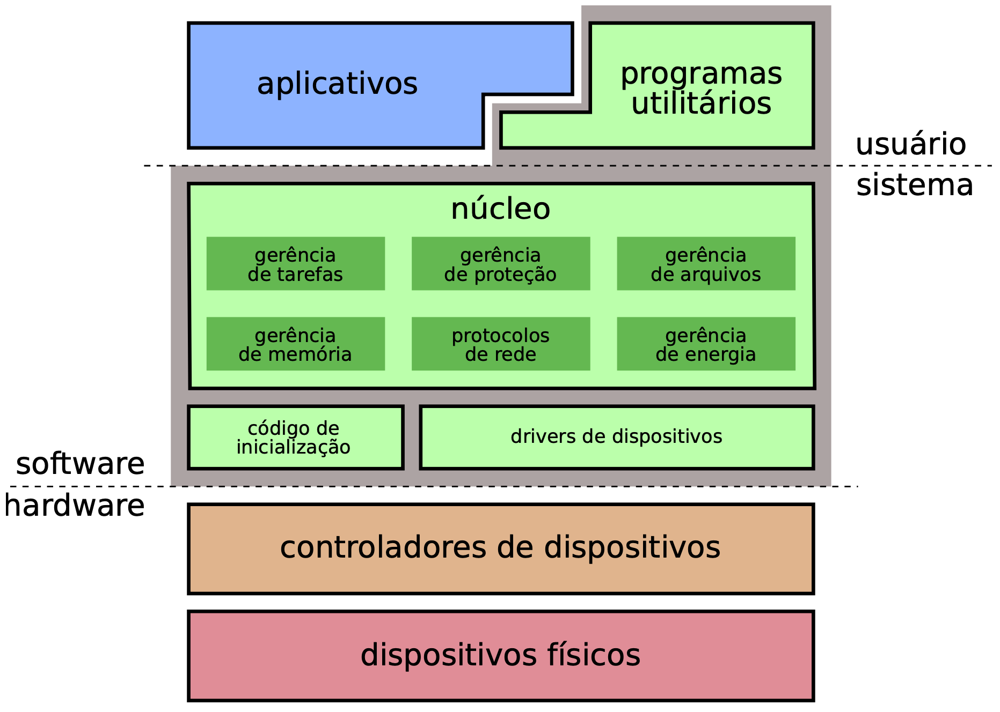

<!-- _paginate: false -->
# **Sistemas Operacionais Desktop**

## Aula 2 - Estrutura do Sistema Operacional

---

## Monoprocessado e Multiprocessado

- Um sistema operacional pode ser classificado monoprocessado ou multiprocessado
- Monoprocessado
  - Uso de uma única CPU
- Multiprocessado
  - Uso de duas ou mais CPUs

---

## Monoprocessado e Multiprocessado

---

## Características do Monoprocessado

- O tempo de CPU é distribuído entre os diversos programas em execução
  - A CPU somente é alocada para um programa que esteja armazenado em memória naquele instante
- Um programa pode ser transferido da memória para o disco e vice-versa
- Comunicação em tempo real entre o usuário e o sistema. Quando o sistema termina a execução de um comando do usuário, deverá aguardar (ou estar pronto) para o próximo comando

---

## Características do Sistema Multiprocessado

- Utiliza dois mais processadores físicos (separados ou múltiplos núcleos encapsulados no mesmo chip)
- Cada processador possui sua própria Unidade de Controle (UC)
  - A UC é um componente da CPU que direciona a operação do processador
- Os processadores compartilham um único espaço de endereçamento de memória
- O sistema de hardware é como um todo gerenciado por um único sistema operacional

---

## Vantagens do Sistema Multiprocessado

- Aumento do throughput (quantidade de programas executados por unidade de tempo)
- Economia (compartilhamento de recursos)
- Confiabilidade (redundância)

---

## Estrutura do Sistema Operacional

- Componentes mais relevantes:
  - **Núcleo**: gerência dos recursos do hardware usados pelas aplicações. Também implementa as principais abstrações utilizadas pelos aplicativos
  - **Inicialização**: reconhece os dispositivos instalados e carrega o núcleo do sistema na memória
  - **Drivers**: módulos de código para acessar os dispositivos físicos
  - **Utilitários**: funcionalidades complementares, como formatação de discos, shell de commandos, interface gráfica, etc.

---

## Estrutura do Sistema Operacional

---

## O Núcleo do Sistema

- O núcleo ou kernel é o componente central do sistema operacional da maioria dos computadores; ele serve de ponte entre aplicativos e o processamento real de dados feito a nível de hardware
- A camada mais baixa do sistema operacional (nível mais inferior de abstração) e que usualmente executa em um modo especial de operação do processador, denominado modo privilegiado ou modo sistema
- O principal propósito é gerenciar os recursos do computador e permitir que outros programas executem e usem destes recursos

---

## O Núcleo do Sistema

- O núcleo (e os drivers) deve ter pleno acesso ao hardware, para poder configurá-lo e gerenciá-lo. Os aplicativos e utilitários devem ter acesso mais restrito a ele, para não interferir nas configurações e na gerência, o que poderia desestabilizar o sistema inteiro

---

## O Núcleo do Sistema

- Responsabilidades:
  - Gerenciar os recursos do sistema (a comunicação entre componentes de hardware e software)
  - Oferecer a camada de abstração de nível mais baixo para os recursos (especialmente processadores e dispositivos de entrada/saída)
  - Oferecer para os processos de aplicativos mecanismos de comunicação entre processos e chamadas de sistema

---

## O Núcleo do Sistema

- Geralmente um núcleo vai fornecer recursos para:
  - Escalonamento de processos de baixo nível
  - Comunicação entre processos
  - Sincronização de processos
  - Troca de contexto
  - Manipulação de blocos de controle de processo
  - Gerenciamento de interrupções
  - Criação, destruição, suspenção e continuação de processos

---

## O Núcleo do Sistema

- Tipos de núcleos, de acordo com o design/abordagem:
  - Monolítico: executa todos os códigos de sistema no mesmo espaço de endereçamento para aumentar a performance do sistema
    - Exemplos: Linux, Windows, Android
  - Micronúcleo: executa a maioria dos serviços do sistema no espaço de usuário como servidores, buscando melhorar a manutenção e a modularidade do sistema operacional
    - Exemplos: QNX, GNU Hurd, L4

---

## Referências Bibliográficas

- Tanenbaum, A. "Sistemas Operacionais Modernos, 3ª edição". São Paulo: Pearson Prentice Hall, 2010.
- Wikipedia. "Multiprocessamento". https://pt.wikipedia.org/wiki/Multiprocessamento, acessado em 09/05/2023
- Wikipedia. "Unidade de controle". https://pt.wikipedia.org/wiki/Unidade_de_controle, acessado em 09/05/2023

---

## Referências Bibliográficas

- Alexandre Meslin. "Sistemas Operacionais". http://www.inf.puc-rio.br/~meslin/SO/SO.pdf, slides de aula acessados em 09/05/2023
- MAZIERO, C. "Sistemas Operacionais: Conceitos e Mecanismos". Editora da UFPR, 2019. 456 p. ISBN 978-85-7335-340-2, https://wiki.inf.ufpr.br/maziero/doku.php?id=socm:start, acessado em 09/05/2023
- Wikipedia. "Núcleo (sistema operacional)". https://pt.wikipedia.org/wiki/N%C3%BAcleo_(sistema_operacional), acessado em 09/05/2023
