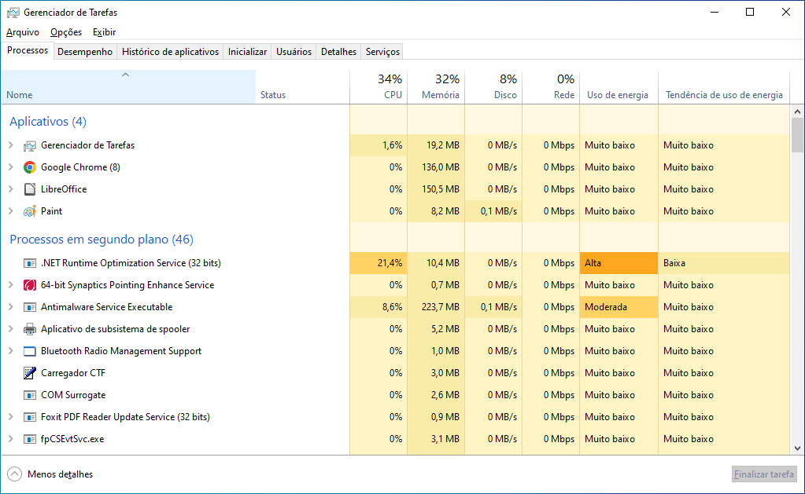
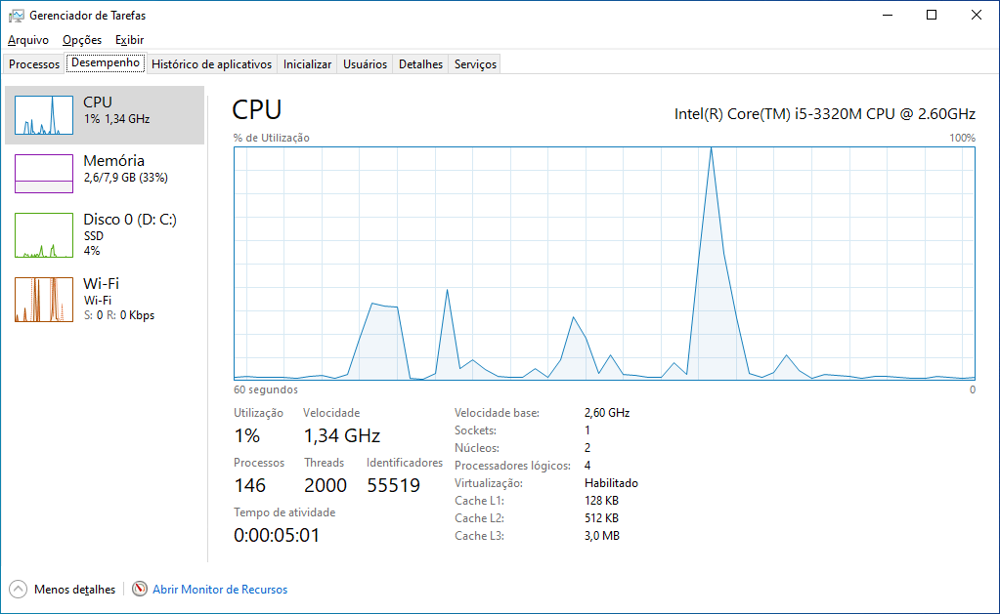
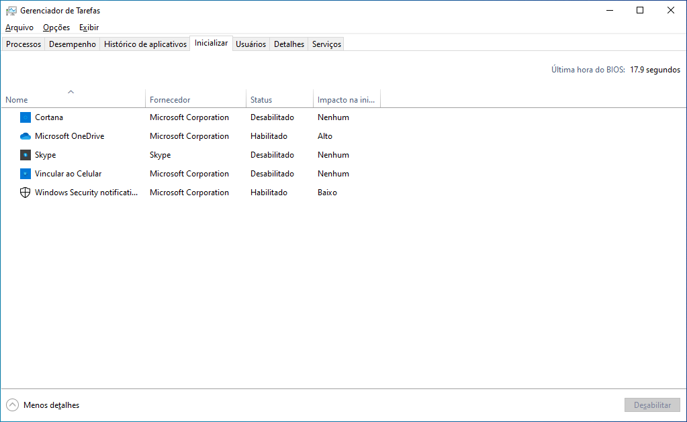
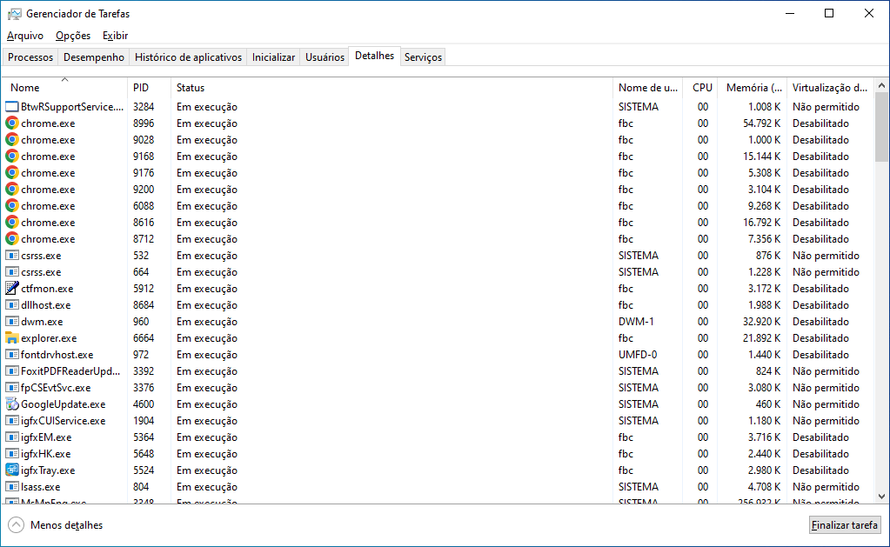
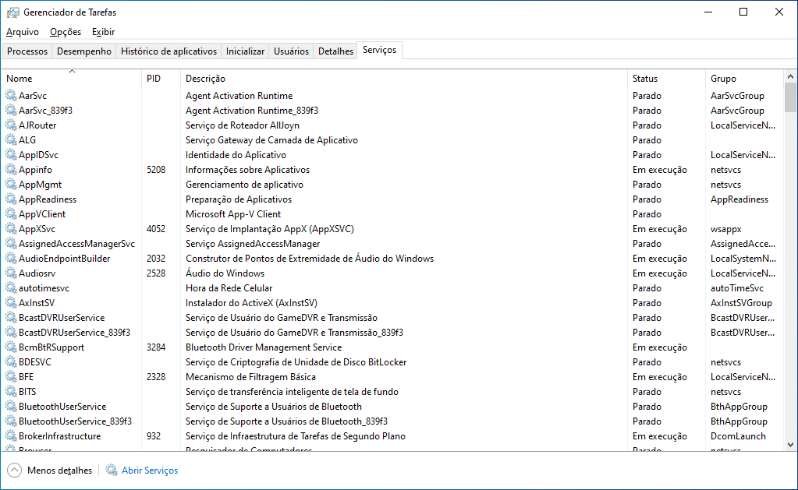
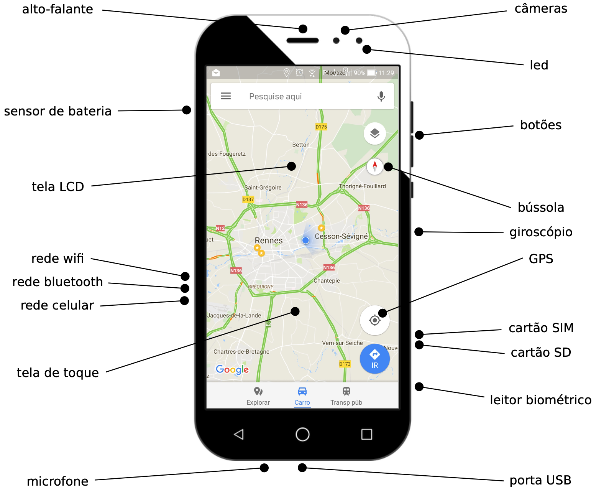
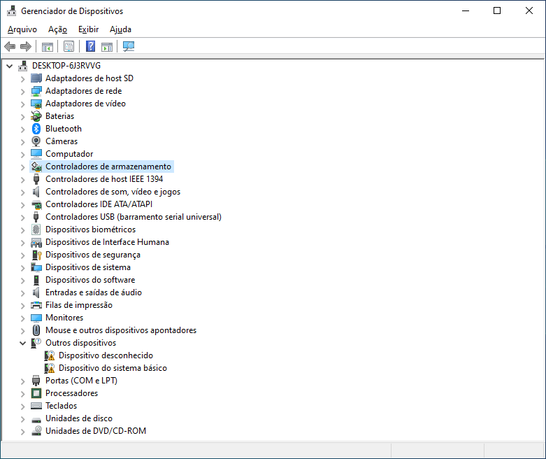
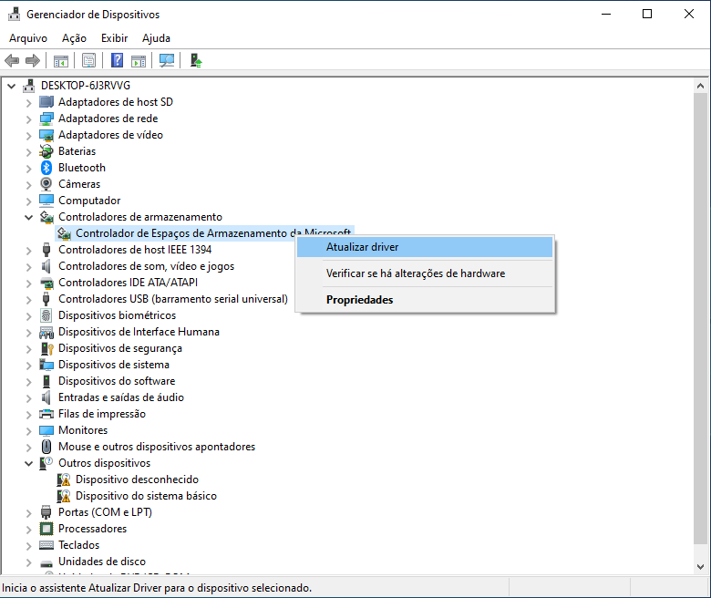
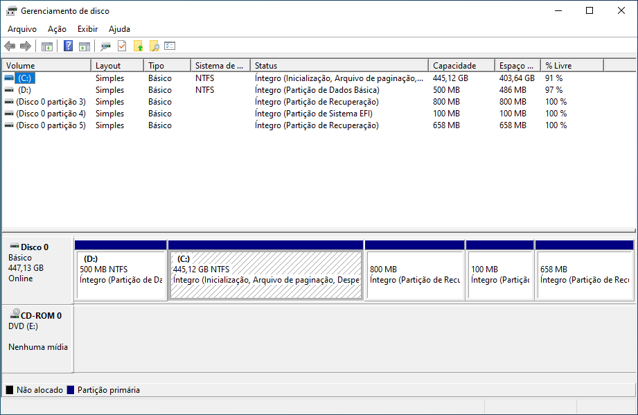

<!-- _paginate: false -->
# **Sistemas Operacionais Desktop**

## Aula 3 - Processos e Gerência de Dispositivos de E/S

---

## Programa

- Código (sequência de instruções) para tratar um problema
- São aplicações ou utilitários
- Conceito **estático**, sem estado interno
- Exemplos:
  - `C:\Windows\notepad.exe`
  - `/usr/bin/firefox`
  
---

## Processo

- É uma instância de um programa em execução em um sistema operacional
- Contém informações sobre o estado atual do programa, incluindo a memória alocada, os registradores de CPU, os identificadores de recursos e outras informações relevantes para o sistema operacional

---
## Tarefa

- Execução das instruções definidas no programa
- Conceito **dinâmico**, com estado interno
- Estado interno evolui a cada instante
- Implementada de várias formas (processos, threads, ...)
- Exemplos:
  - O *Bloco de Notas* editando um arquivo `nomes.txt`
  - O visualizador de PDFs mostrando este slide

---

## Processo e Tarefa

- Os termos "processo" e "tarefa" podem ser considerados sinônimos em alguns contextos, mas em geral, eles se referem a conceitos diferentes

---

## Gerenciador de Tarefas (Windows)

- O Gerenciador de Tarefas é um gerenciador de tarefas, monitor de sistema e gerenciador de inicialização incluído nos sistemas Microsoft Windows
- Fornece informações sobre o desempenho do computador e software em execução, incluindo nome dos processos em execução, carga da CPU e GPU, carga de confirmação, detalhes de E/S, usuários conectados e serviços do Windows
- Pode ser usado para definir prioridades de processo, iniciar e interromper serviços e encerrar processos à força

---

## Gerenciador de Tarefas (Windows)

- Para executar existem três formas diferentes:
  1. Clicar na barra de pesquisa no canto inferior do Windows e digitar “Tarefas”, selecionando o ícone do Gerenciador
  2. Utilizar as teclas de atalho <kbd>Ctrl</kbd> + <kbd>Shift</kbd> + <kbd>Esc</kbd>
  3. Utilizar as teclas de atalho <kbd>Ctrl</kbd> + <kbd>Alt</kbd> + <kbd>Del</kbd> e depois escolher a opção "Gerenciador de Tarefas"

---

## Gerenciador de Tarefas (Windows)

---

## Gerenciador de Tarefas (Windows)

- Para interromper um aplicativo ou processo, escolha o aplicativo/processo a ser interrompido e clique no botão "Finalizar tarefa"
- Para visualizar o aplicativo ou processo que está consumindo mais recursos, ordene a coluna do recurso do maior para menor

---

## Gerenciador de Tarefas (Windows)

---

## Gerenciador de Tarefas (Windows)

---

## Gerenciador de Tarefas (Windows)

---

## Gerenciador de Tarefas (Windows)

---

## Dispositivos de Entrada/Saída (E/S)

- Interação da CPU com o mundo exterior
- Função: informações física <-> informações digitais
- Varidade de dispositivos:
  - Interação com o usuário: mouse, teclado, tela, fone
  - Armazenamento de dados: discos, SSDs, CD-ROMs
  - Impressão e captura de dados: impressora, scanner
  - Comunicação com outros sistemas: ethernet, bluetooth
  - Gerência do sistema: tempo, energia, temperatura
  - Localização: GPS, bússola, giroscópio

---

## Disp. de E/S em um Smartphone (Exemplo)

---

## Gerência de Dipositivos de E/S no Windows

- O Windows apresenta algumas ferramentas para gerenciar dipositivos de entrada e saída de dados:
  - Gerenciador de Dispositivos
  - Gerenciamento de Disco

---

## Gerenciador de Dispositivos

- Permite visualizar e controlar o hardware conectado ao computador
- Quando um dispositivo não está funcionando ele é destacado para que o usuário o manipule
- Para cada dispositivo é possível:
  - Fornecer drivers de acordo com o modelo de driver do Windows
  - Ativar ou desativar dispositivos
  - Ignorar dispositivos com defeito
  - Ver outras propriedades técnicas

---

## Gerenciador de Dispositivos

- Para executar existem três formas diferentes:
  1. Clicar na barra de pesquisa no canto inferior do Windows e digitar "Gerenciador de Dispositivos", selecionando o ícone do Gerenciador
  2. Clicar no ícone Iniciar do Windows com o botão direito do mouse e selecionar "Gerenciador de Dispositivos"
  3. Ir no Painel de Controle e clicar em "Gerenciador de Dispositivos"

---

## Gerenciador de Dispositivos

---

## Gerenciador de Dispositivos

---

## Gerenciamento de Disco

- É um utilitário do sistema Windows usado para operações avançadas de armazenamento
- Algumas tarefas que são possíveis de realizar:
  - Configurar uma nova unidade
  - Estender um volume para um espaço que ainda não faz parte de um volume na mesma unidade
  - Reduzir uma partição, como habilitar a extensão para uma partição vizinha
  - Alterar uma letra da unidade ou atributir uma nova letra

---

## Gerenciamento de Disco

- Embora o Gerenciamento de Disco dê suporte a uma ampla variedade de tarefas, algumas precisam ser realizadas com outras ferramentas
- Algumas dessas tarefas que precisam ser realizadas com outras ferramentas são:
  - Liberar espaço em disco
  - Desfragmentar ou otimizar unidades
  - Agrupar vários disco rígidos, semelhante a um RAID (Redudante Array of Independent Disks)

---

## Gerenciamento de Disco

- Para executar existem duas formas diferentes:
  1. Clicar na barra de pesquisa no canto inferior do Windows e digitar "Gerenciamento de Disco", selecionando o ícone do Gerenciamento de Disco
  2. Clicar no ícone Iniciar do Windows com o botão direito do mouse e selecionar "Gerenciamento de Disco"

---

## Gerenciamento de Disco

---

## Referências Bibliográficas

- MAZIERO, C. "Sistemas Operacionais: Conceitos e Mecanismos". Editora da UFPR, 2019. 456 p. ISBN 978-85-7335-340-2, https://wiki.inf.ufpr.br/maziero/doku.php?id=socm:start, acessado em 09/05/2023
- Tanenbaum, A. "Sistemas Operacionais Modernos, 3ª edição". São Paulo: Pearson Prentice Hall, 2010.
- Wikipedia. "Task Manager (Windows)". https://en.wikipedia.org/wiki/Task_Manager_(Windows), acessado em 15/05/2023

---

## Referências Bibliográficas

- Tecnoblog. "Como abrir o Gerenciador de Tarefas do Windows". https://tecnoblog.net/responde/como-abrir-o-gerenciador-de-tarefas-do-windows/, acessado em 15/05/2023
- Wikipedia. "Gerenciador de Dispositivos". https://pt.wikipedia.org/wiki/Gerenciador_de_Dispositivos, acessado em 15/05/2023
- Microsoft. "Visão geral do Gerenciamento de disco". https://learn.microsoft.com/pt-br/windows-server/storage/disk-management/overview-of-disk-management, acessado em 15/05/2023