

<!-- _paginate: false -->
# **Sistemas Operacionais Desktop**

## Aula 4 - Gerenciamento de Memória e Memória Virtual

---

## Gerenciamento de Memória

- Idealmente os programadores querem uma memória que seja:
  - Grande
  - Rápida
  - Não volátil
  - De baixo custo
- Infelizmente a tecnologia atual não comporta tais memórias

---

## Hierarquia da Memória

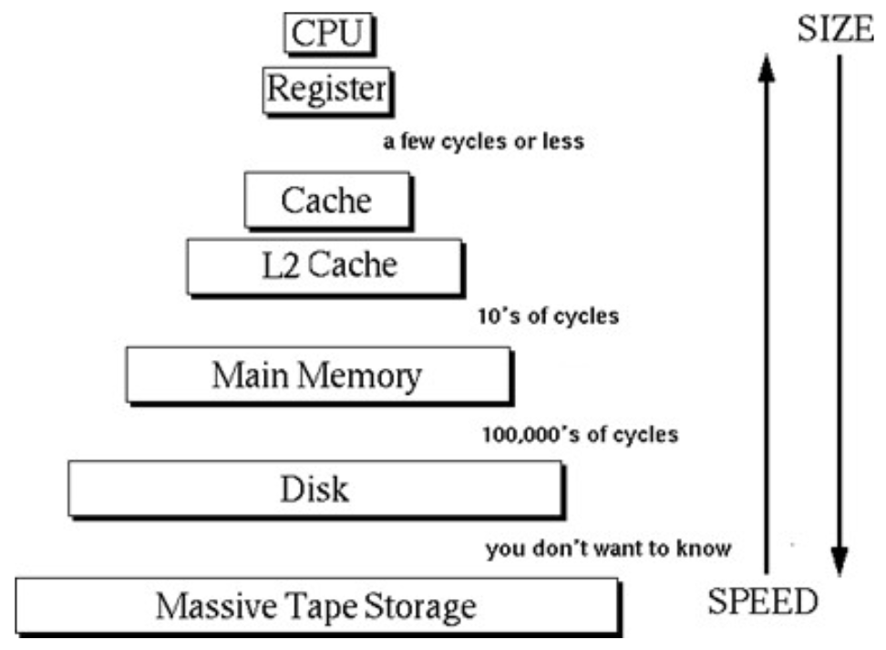

---

## Tarefas do Gerenciador de Memória

- Gerenciar a hierarquia de memória
  - Gerenciar espaços livres/ocupados
  - Alocar e localizar processos/dados na memória
- Controlar as partes que estão em uso, e as que não, para:
  - **Alocar** memória aos processos, quando estes precisarem
  - **Liberar** memória quando um processo termina
  - Tratar do problema de swapping
    - Responsável por gerenciar chaveamento entre a memória principal e o disco e memória principal e memória cache

---

## Gerenciamento de Memória - Monoprogramação

- Apenas um programa é carregado por vez
  
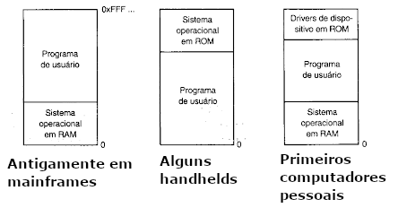

---

## Gerenciamento de Memória - Multiprogramação

- Como fazer para armazenar n processos na memória?
  - Divida a memória em n partições, de tamanho fixo
  - Não necessariamente iguais
  - Ao chegar um job (um ou mais processos), coloque-o na fila
  - O espaço que sobrar não será utilizado

---

## Gerenciamento de Memória - Multiprogramação

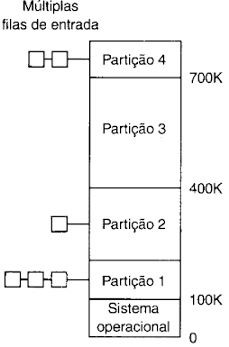

---

## Endereçamento - Multiprogramação

- Como dar a cada programa seu próprio espaço de endereços, de modo que o endereço 28 em um seja diferente, na memória física, do 28 em outro?
- 2 registradores -> base e limite
- A CPU adiciona o valor base ao endereço
- Verifica se o endereço é maior ou igual ao limite
- Obsoleto

---

## Endereçamento - Multiprogramação

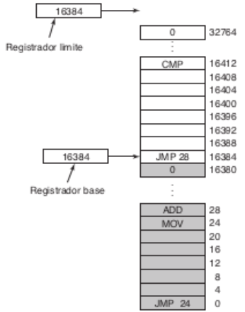

---

## O que é MMU?

- Dispositivo de hardware que transforma endereços virtuais em endereços físicos
- Na MMU (Memory Management Unit):
  - O valor do registro de realocação é adicionado a todo o endereço lógico
  - O programa manipula endereços lógicos; ele nunca vê endereços físicos reais

---

## Memórias Particionada - Tipos

- Partições fixas (ou alocação estática)
  - Tamanho e número de partições são fixos (estáticos)
  - Tendem a desperdiçar memória
  - Mais simples

---

## Memórias Particionada - Tipos

- Partições variáveis (ou alocação dinâmica)
  - Tamanho e número de partições variam
  - Otimiza a utilização de memória, mas complica a alocação e liberação
  - Partições são alocadas dinamicamente
  - Menor fragmentação interna e maior fragmentação externa

---

## Partições Variáveis

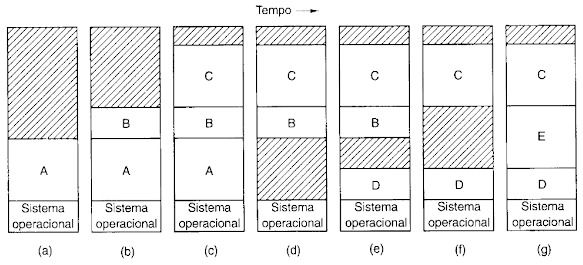

---

## O que é Swapping?

- Chaveamento de processos entre a memória e o disco
- Swap-out: da memória para o disco em uma área de "swap"
- Swap-in: do disco para a memória
- Fragmentação interna e externa

---

## Estruturas para Gerenciar a Memória

- Mapa de Bits (Bitmaps)
  - Memória é dividida em unidades de alocação
  - Unidade pode conter vários KB
  - Cada unidade corresponde a um bit no bitmap:
    - 0 -> livre
    - 1 -> ocupado
- Lista encadeada
  - Manter uma lista ligada de segmentos de memória livres e alocados

---

## Estruturas para Gerenciar a Memória

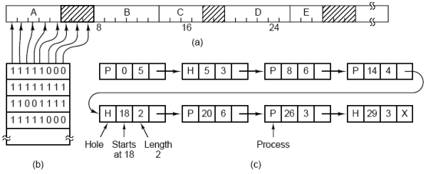

---

## Algoritmos de Alocação

- Primeira escolha
  - Percorre a lista até que encontre o primeiro que caiba
- Melhor escolha
  - Busca a lista inteira e toma a menor partição
- Pior escolha
  - Busca a lista inteira para a maior partição

---

## Algoritmos de Alocação

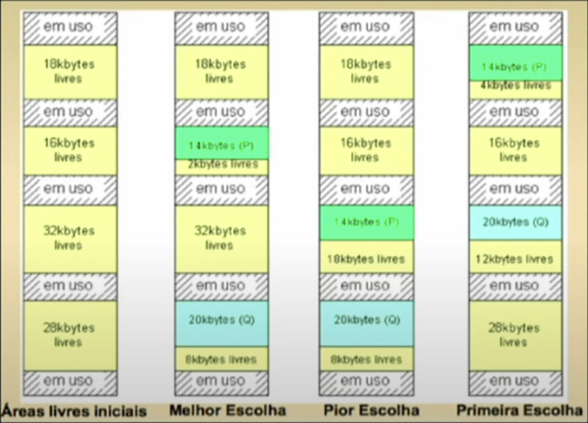

---

## O que é Memória Virtual (MV)?

- É uma técnica que usa a memória secundária como uma "cache" para partes do espaço dos processos
- Por que memória virtual?
  - O tamanho do software cada vez maior
  - Maior grau de multiprogramação
  - Executa programas maiores que a RAM
- Um processo usa endereços virtuais e não físicos
  - Utiliza a MMU para conversão

---

## O que é Memória Virtual (MV)?

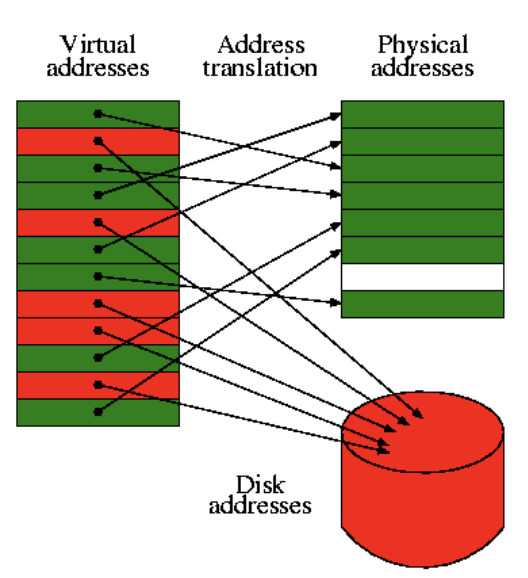

---

## Técnicas de Memória Virtual

- Paginação
  - Blocos de tamanho fixo (e.g. 4KB)
  - O espaço de endereçamento virtual é dividido em páginas virtuais
- Segmentação
  - Blocos de tamanho arbitrário chamados de segmentos
  - Contém o mesmo tipo de informações (e.g. dados, pilha)
- Mapeamento entre endereços reais e virtuais (MMU)
- Muitos SOs usam uma "mistura" das duas técnicas

---

## Paginação

- Páginas: unidades de tamanho fixo no dispositivo secundário
- Frames: unidades correspondentes na memória física (RAM)
- Page fault: é o evento quando uma página que não está na RAM é referenciada
  - Usa uma *trap* para carregar ou substituir uma página
- Tabela de Páginas: estrutura para mapear uma página ao frame correspondente
  - Cada processo tem um

---

## Exemplo de Paginação

- Um sistema que gera 64K de endereços virtuais (16 páginas e 8 frames)
- MMU faz o mapeamento
- `MOV REG, 5`
- Ela está mapeada ao terceiro frame, que começa em 8K = 8192
- O endereço enviado ao barramento é 5 + 8192 = 8197

---

## Exemplo de Paginação

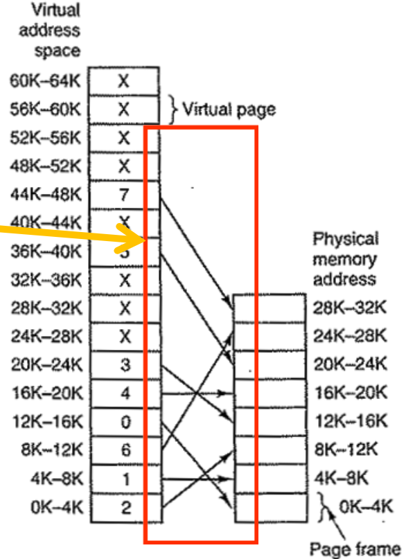

---

## Tabela de Páginas

- Argumento de entrada -> nº página virtual
- Argumento de saída -> nº página real

---

## Tabela de Páginas

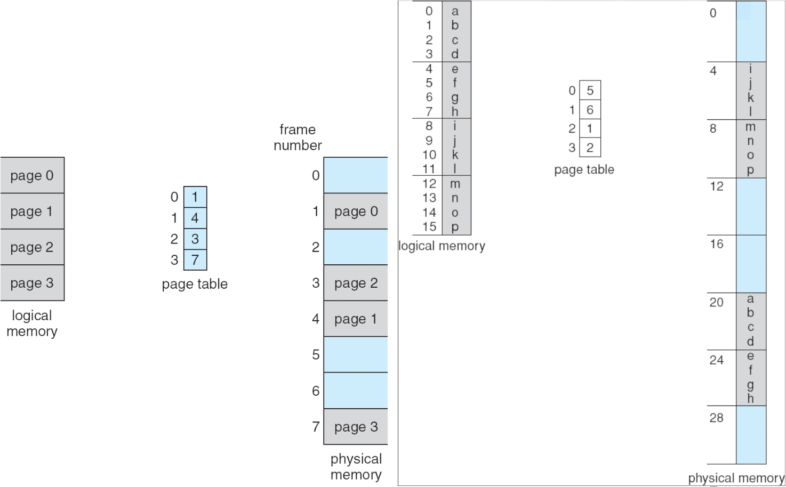

---

## Busca de um Endereço

- Busca sequencial? Binária?
- Qualquer que seja a alternativa, é lenta
- Ideal - o nº da página servir como índice na tabela

---

## Busca de um Endereço

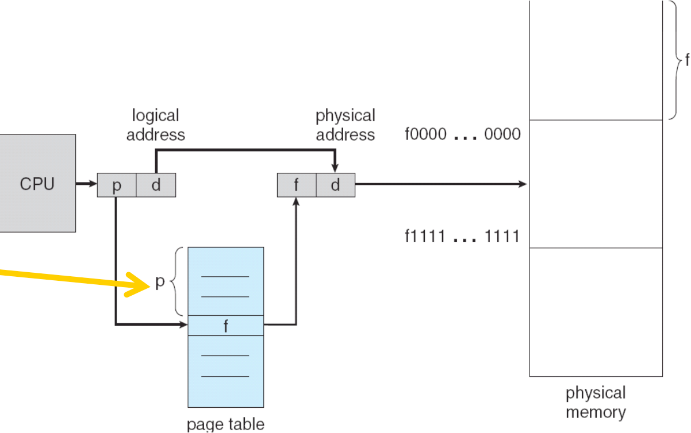

---

## Exemplo de uma Busca

- Endereço 0010000000000100

- MMU com 16 páginas de 4KB
- Endereço virtual de 16 bits
- A tabela tem 16 entradas (0000 a 1111)
- Hardware com 8 frames
- Endereço virtual de 15 bits

---

## Exemplo de uma Busca

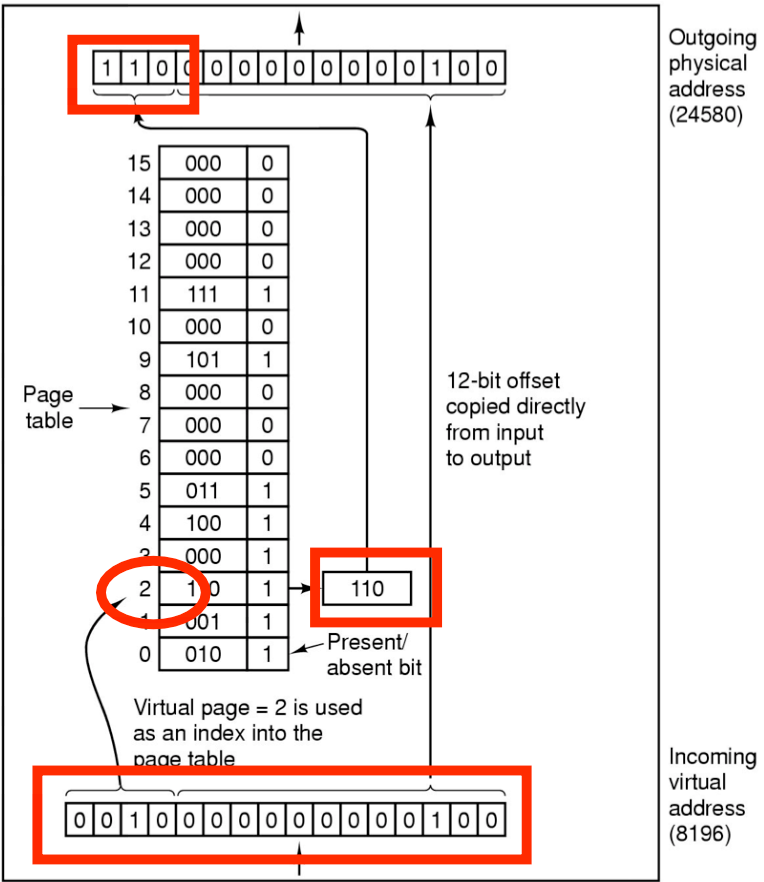

---

## Componentes do Endereço

- Número de página (p): usado como índice para uma tabela de página
- Deslocamento de página (d): combinado com o endereço de base para definir o endereço de memória física que é enviado à unidade de memoria
- Páginas maiores: leitura mais eficiente, tabela menor, mas fragmentação interna
- Páginas menores: leitura menos eficiente, tabela maior, mas menor fragmentação

---

## Componentes da Tabela

- Page frame number: identifica (número) a página real
- Bit de Residência (presente/ausente): se 1, então página correspondente é válida e está na RAM; page fault?
- Bits de proteção: 0 (leitura/escrita), 1 (leitura) 2 (execução)
- Bit de modificação: 1 (página alterada) / 0 (não alterada)
- Bit de referência: 1 (foi referenciada "recentemente")
- Bit de cache: permite desabilitar o *caching* da página

---

## Onde Armazenar as Tabelas?

- Array de Registradores, se a memória for pequena
  - Mantidos em hardware
- Na própria memória RAM
  - A MMU gerencia utilizando um ou dois registradores
- Em uma memória cache na MMU chamada Memória Associativa
  - Usada para melhorar o desempenho da tabela na RAM

---

## Tabela na RAM

- Usa dois registradores
  - Registrador de base da tabela de página (PTBR): aponta para o início da tabela, indicando o endereço físico de memória onde a tabela está alocada
  - Registrador de tamanho da tabela de página (PTLR): indica o tamanho da tabela de página (número de entradas da tabela -> número de páginas)

---

## Tabela na RAM

- Problema: dois acessos para instrução/dados na RAM
  - Um para a tabela e outro para o dado/instrução em si
- Solução: cache chamado Translation Lookaside Buffer (TLB)

---

## Translation Lookaside Buffer (TLB)

- Cache da tabela das páginas mais usadas (hardware)

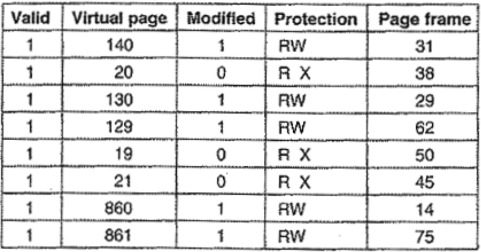

---

## Funcionamento da TLB

- Pode ser implementada em hardware ou software
- Em hardware é mais rápido, mas ocupa um espaço que poderia ser usado por outras funções, como cache

---

## Funcionamento da TLB

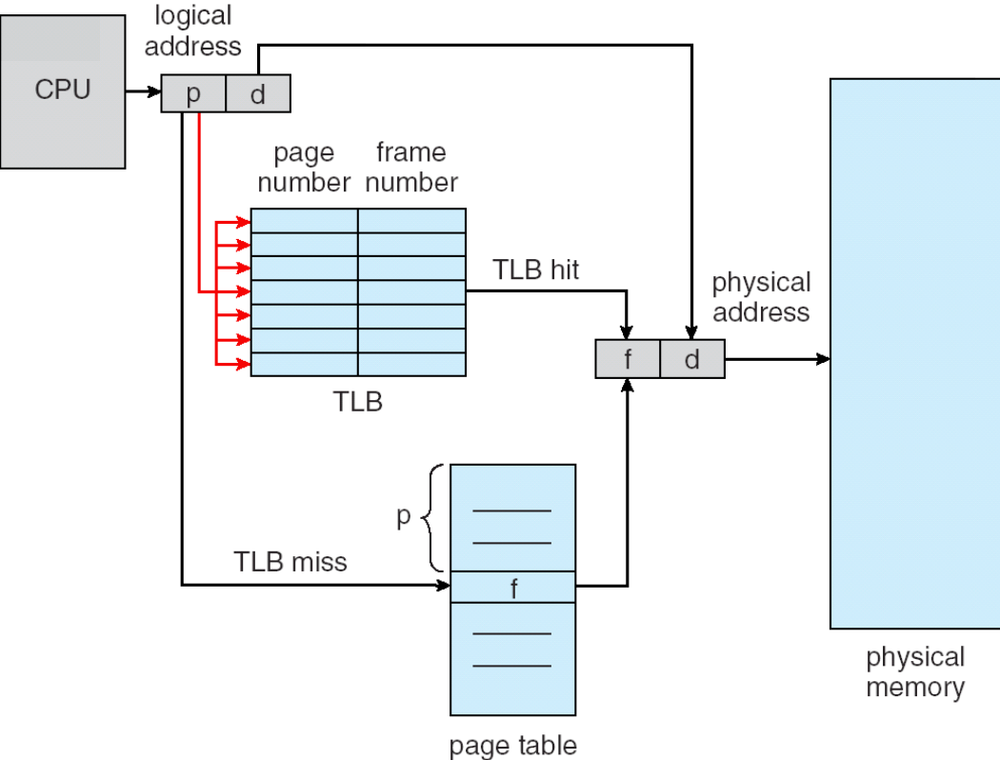

---

## Dois Tipos de Falha de Página

- Soft miss
  - Quando a página referenciada não está na TLB, mas na RAM
  - Basta atualizar a TLB
- Hard miss
  - A página não está na memória física (e nem na TLB)
  - Trazer do disco à RAM (e então à TLB)
  - Muito lento

---

## Referências Bibliográficas

- UNIVESP. "Engenharia de Computação - Sistemas Operacionais", Video aulas 17 e 18, https://www.youtube.com/playlist?list=PLxI8Can9yAHeK7GUEGxMsqoPRmJKwI9Jw, acessados em 09/05/2023
- Tanenbaum, A. "Sistemas Operacionais Modernos, 3ª edição". São Paulo: Pearson Prentice Hall, 2010.
- Hierarquia de Memória. https://slideplayer.com.br/slide/5622355/, acessado em 09/05/2023

---

## Referências Bibliográficas

- MAZIERO, C. "Sistemas Operacionais: Conceitos e Mecanismos". Editora da UFPR, 2019. 456 p. ISBN 978-85-7335-340-2, https://wiki.inf.ufpr.br/maziero/doku.php?id=socm:start, acessado em 09/05/2023
- Wikipedia. "Gerenciamento de memória". https://pt.wikipedia.org/wiki/Gerenciamento_de_mem%C3%B3ria, acessado em 24/05/2023
