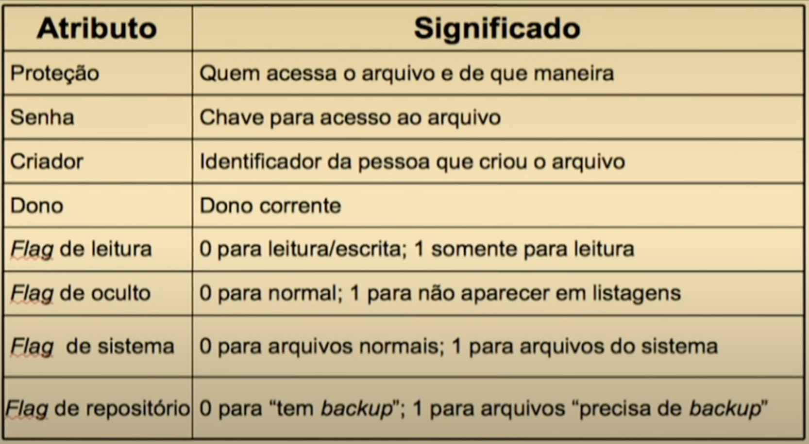

<!-- _paginate: false -->
# **Sistemas Operacionais Desktop**

## Aula 5 - Gerenciamento de Arquivos e Sistemas de Arquivos

---

## Requisitos de Armazenamento Persistente

- Armazenar e recuperar *big data* (3 Vs - Volume, Variedade e Velocidade)
- Informação gerada por um processo:
  - Continuar após a finalização do processo
- Dar acesso à informação a múltiplos processos:
  - Concorrentemente
  - Informações devem ser independentes de processos

---

## Armazenamento Persistente: Arquivos

- Criados por processos
- Processos podem ler ou escrever em arquivos
- Ou podem criar novos arquivos
- Informações armazenadas devem ser persistentes
  - Não podem ser afetadas pela criação ou finalização de um processo

---

## Armazenamento Persistente: Arquivos

- Arquivos são gerenciados pelo SO
  - São estruturados, nomeados, acessados, usados, protegidos, implementados e gerenciados
  - Por meio de chamadas de sistema (system calls)
- Sistema de arquivos
  - Parte do SO responsável por tratar dos arquivos
  - Uma das partes mais visíveis ao usuário

---

## Ponto de Vista do Sistema de Arquivos

- Ponto de vista do usuário (alto nível):
  - Interface -> como os arquivos aparecem
  - Como são nomeados e protegidos
  - Operações que podem ser realizadas
- Ponto de vista do SO (baixo nível):
  - Como os arquivos são armazenados fisicamente
  - Como os arquivos são referenciados (links)

---

## Nomes de Arquivos

- Quando criados, nomes são dados
- Referenciados por meio de seus nomes
- Tamanho: até 255 caracteres
- Restrição: MS-DOS aceita de 1-8 caracteres
- Letras, números, caracteres especiais podem compor nomes de arquivos:
  - Caracteres permitidos: A-Z, a-z, 0-9, $, %, ', @, {, }, ˜, `, #m (, ), &
  - Caracteres não permitidos: ?, *, /, \, ", |, <, >

---

## Nomes de Arquivos

- Alguns SO são sensíveis (Case Sensitive)
- UNIX é sensível:
  - Ex.: exemplo.c é diferente de Exemplo.c
- MS-DOS não é sensível
  - Ex.: exemplo.c é o mesmo que Exemplo.c
- Win95/Win98/WinNT/Win2000 herdaram características do sistema de arquivos do MS-DOS
- Em particular, WinNT/Win2000 usam um Sistema de Arquivos próprio: NTFS (New Technology File System)

---

## Extensão dos Arquivos

- Alguns SO suportam uma extensão relacionada
- MS-DOS:
  - 1-3 caracteres; suporta apenas uma extensão
  - 8 caracteres para nome + 3 para extensão
- UNIX:
  - Mais de 3 caracteres
  - Mais de uma extensão: Ex.: exemplo.c.Z (compressão)
  - Sem extensão
  - Nome + extensões não maior que 255 caracteres

---

## Extensão dos Arquivos

- Geralmente associa a algum aplicativo
  - *.doc - Microsoft Word
  - *.c - Compilador C
- SO pode ou não associar as extensões aos aplicativos
- Unix não associa
- Linux associa algumas
  - Mas apenas na GUI
  - Facilidade de uso
- Windows associa

---

## Extensão de Arquivos: Exemplos

---

## Estruturas de Arquivos

1. Sequência não estruturada de bytes
   - Para o SO são apenas um conjunto de bytes
   - SO não se importa com o conteúdo do arquivo
   - Significado deve ser dado pelas aplicações
   - Vantagem: flexibilidade
     - Os usuários colocam o que quiserem
     - Nomeiam arquivos como quiserem
   - Ex.: UNIX e Windows (tam. em bytes)

---

## Estruturas de Arquivos

2. Sequência de registros de tamanho fixo:
   - Cada qual com alguma estrutura interna
   - Ex.: 80 e 132 caracteres
   - Leitura/escrita são realizadas em registros
   - Lê, sobrescreve ou adiciona um registro
   - SOs mais antigos -> mainframes
   - Os 80 caracteres do cartão perfurado
   - Nenhum sistema atual usa esse esquema

---

## Estruturas de Arquivos

3. Árvores de registro (tamanho variado):
   - Cada parte do arquivo com um campo chave em uma posição fixa
   - O arquivo consiste nessa árvore
   - A operação: obter o registro com uma certa chave
   - SO decide onde colocar novos registros
     - não o usuário
   - Usado em mainframes atuais

---

## Tipos de Arquivos

- Arquivos regulares -> informações dos usuários
- Diretórios
  - Arquivos para estruturar o sistema de arquivos
- Arquivos do sistema
  - /dev
  - /proc

---

## Tipos de Arquivos Regulares

1. ASCII
   - Consistem de linhas de texto com CR+LF
   - Facilitam integração de programas (via arquivo)
   - Podem ser exibidos e impressos como são
   - Podem ser editados em qualquer editor de texto
     - Ex.: arquivos-texto
   - Mais portável e interoperável

---

## Tipos de Arquivos Regulares

2. Binário:
   - Todo arquivo não ASCII
   - Estrutura interna conhecida apenas pelos aplicativos que os usam
   - Ex.: programa executável

---

## Exemplo de Arquivo Binário

- Um documento em Microsoft Word
- É um arquivo binário

---

## Atributos de Arquivos

- Além do nome e dos dados
  - Todo arquivo tem outras informações sobre ele
- Atributos
  - Metadados
- A lista de atributos varia de SO para SO

---

## Atributos de Arquivos

---

## Referências Bibliográficas

- UNIVESP. "Engenharia de Computação - Sistemas Operacionais", Video aula 25, https://www.youtube.com/watch?v=PKox6AlVTT8, acessado em 10/05/2023
- Tanenbaum, A. "Sistemas Operacionais Modernos, 3ª edição". São Paulo: Pearson Prentice Hall, 2010.
- MAZIERO, C. "Sistemas Operacionais: Conceitos e Mecanismos". Editora da UFPR, 2019. 456 p. ISBN 978-85-7335-340-2, https://wiki.inf.ufpr.br/maziero/doku.php?id=socm:start, acessado em 09/05/2023

